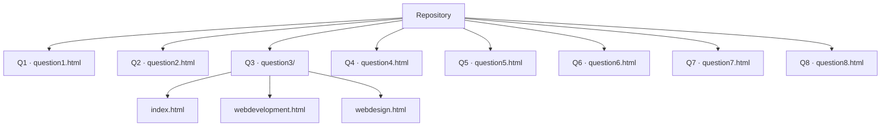

# 🗺️ Assignment Page Map

```mermaid
flowchart TB
  ROOT["Repository"]
  ROOT --> Q1["Q1 · question1.html"]
  ROOT --> Q2["Q2 · question2.html"]
  ROOT --> Q3["Q3 · question3/"]
  ROOT --> Q4["Q4 · question4.html"]
  ROOT --> Q5["Q5 · question5.html"]
  ROOT --> Q6["Q6 · question6.html"]
  ROOT --> Q7["Q7 · question7.html"]
  ROOT --> Q8["Q8 · question8.html"]
  Q3 --> H["index.html"]
  Q3 --> WDEV["webdevelopment.html"]
  Q3 --> WDES["webdesign.html"]
```

The screenshot folder contains existing PNG evidence associated with Q1–Q8. See [screenshot catalog](../assets/screenshots.md).
